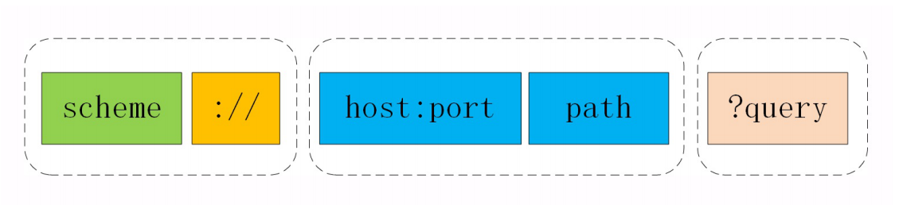

<!-- GFM-TOC -->
* [一 、基础概念](#一-基础概念)
    * [URI](#uri)
    * [请求和响应报文](#请求和响应报文)
    * [请求过程](#请求过程)
* [二、HTTP 方法](#二http-方法)
    * [GET](#get)
    * [HEAD](#head)
    * [POST](#post)
    * [PUT](#put)
    * [PATCH](#patch)
    * [DELETE](#delete)
    * [OPTIONS](#options)
    * [CONNECT](#connect)
    * [TRACE](#trace)
* [三、HTTP 状态码](#三http-状态码)
    * [1XX 信息](#1xx-信息)
    * [2XX 成功](#2xx-成功)
    * [3XX 重定向](#3xx-重定向)
    * [4XX 客户端错误](#4xx-客户端错误)
    * [5XX 服务器错误](#5xx-服务器错误)
* [四、HTTP 首部](#四http-首部)
    * [通用首部字段](#通用首部字段)
    * [请求首部字段](#请求首部字段)
    * [响应首部字段](#响应首部字段)
    * [实体首部字段](#实体首部字段)
* [五、具体应用](#五具体应用)
    * [连接管理](#连接管理)
    * [Cookie](#cookie)
    * [缓存](#缓存)
    * [内容协商](#内容协商)
    * [内容编码](#内容编码)
    * [范围请求](#范围请求)
    * [分块传输编码](#分块传输编码)
    * [多部分对象集合](#多部分对象集合)
    * [虚拟主机](#虚拟主机)
    * [通信数据转发](#通信数据转发)
* [六、HTTPS](#六https)
    * [加密](#加密)
    * [认证](#认证)
    * [完整性保护](#完整性保护)
    * [HTTPS 的缺点](#https-的缺点)
    * [重定向HTTPS](#重定向HTTPS)
* [七、HTTP/2.0](#七http20)
    * [HTTP/1.x 缺陷](#http1x-缺陷)
    * [多路复用](#多路复用)
    * [二进制分帧层](#二进制分帧层)
    * [服务端推送](#服务端推送)
    * [首部压缩](#首部压缩)
* [八、HTTP/1.1 新特性](#八http11-新特性)
* [九、GET 和 POST 比较](#九get-和-post-比较)
    * [作用](#作用)
    * [参数](#参数)
    * [安全](#安全)
    * [幂等性](#幂等性)
    * [可缓存](#可缓存)
    * [XMLHttpRequest](#xmlhttprequest)
* [参考资料](#参考资料)
<!-- GFM-TOC -->


# 一 、基础概念

HTTP是一个在计算机世界里专门在两点之间传输文字、图
片、音频、视频等超文本数据的约定和规范


HTTP 可运行在 TCP/IP 之上，也可运行在 UNIX Domain Socket 之上

## URI

<div align="center">  </div><br>

URI 包含 URL 和 URN。

<div align="center">  </div><br>

注意：

URI引入了编码机制，对于ASCII码以外的字符集和特殊字符做一个特殊的操作，把它们转换成与URI
语义不冲突的形式。这在RFC规范里称为“escape”和“unescape”，俗称"转义"。

## 请求和响应报文

### 1. 请求报文

<div align="center">  </div><br>

### 2. 响应报文

<div align="center">  </div><br>

## 请求过程

浏览器通过DNS(浏览器缓存->操作系统->本地DNS->根DNS->顶级DNS->权威DNS)得到域名对应的IP，User-Agent（一般是指浏览器）会以一个随机端口（1024< 端口 < 65535）向服务器的WEB程序（常用的有httpd,nginx等）的端口发起TCP三次握手建立起连接。

应用程序对实际传输的数据做了一层包装，变成请求报文，调用 Socket API 发出去。报文以二进制流的方式到了 TCP 层，它会把二进制流变成一个个报文段，在发送给每个报文段的时候，都需要对方有一个回应 ACK，或者累计 ACK 来保证报文可靠地到达了对方。如果没有回应，那么TCP这一层会进行重新传输，直到可以到达，也就是 TCP 保证可靠传输。

TCP 报文段头部有源端口和目的端口来提供了进程间的逻辑通信。到了IP层，IP头部有源IP和目标IP 来进行网络定位。

数据到了链路层，需要知道MAC地址，先查看目标IP和自己是否是在同一个局域网。如果是，就发送ARP广播来请求这个目标IP对应的MAC地址，然后将源MAC和目标MAC放入MAC头，发送出去即可；如果不在同一个局域网，就需要发送到网关，还要需要发送ARP广播来获取网关的MAC地址，然后将源MAC和网关MAC放入MAC头，发送出去。

网关收到以太网帧后发现MAC符合，取出目标IP地址，根据路由规则到下一跳的路由器，获取下一跳路由器的MAC地址，将包发给下一跳路由器。

这样路由器一跳一跳终于到达目标的局域网。这个时候，最后一跳的路由器能够发现，目标地址就在自己的某一个出口的局域网上。于是，在这个局域网上发送ARP，获得这个目标地址的MAC地址，将包发出去。

目标的机器发现MAC地址符合，就将包收起来；发现IP地址符合，根据IP头中协议项，知道自己上一层是TCP协议，于是解析TCP的头，里面有序列号，需要看一看这个序列包是不是我要的，如果是就放入缓存中然后返回一个ACK，如果不是就丢弃。

TCP头里面还有端口号，HTTP的服务器正在监听这个端口号。于是，目标机器自然知道是HTTP服务器这个进程想要这个包，于是将包发给HTTP服务器。HTTP服务器的进程看到，原来这个请求是要访问一个网页，于是就把这个网页发给客户端。

当浏览器进程拿到了HTTP的响应报文。发现返回“200”，一切正常，于是就从正文中将HTML拿出来。HTML是一个标准的网页格式。浏览器只要根据这个格式，展示出一个绚丽多彩的网页。

# 二、HTTP 方法

客户端发送的   **请求报文**   第一行为请求行，包含了方法字段。

## GET

> 请求一个指定资源的表示形式. 使用GET的请求应该只被用于获取数据


## HEAD

> 请求一个与GET请求的响应相同的响应，但没有响应体


## POST

> 用于将实体提交到指定的资源，通常导致在服务器上的状态变化或副作用


## PUT

> 用请求有效载荷替换目标资源的所有当前表示


## DELETE

> 删除指定的资源


## PATCH

> 用于对资源应用部分修改

## OPTIONS

> 用于描述目标资源的通信选项

OPTIONS请求旨在发送一种“探测”请求以确定针对某个目标地址的请求必须具有怎样的约束（比如应该采用怎样的HTTP方法以及自定义的请求报头），然后根据其约束发送真正的请求。比如针对“跨域资源”的预检（Preflight）请求采用的HTTP方法就是OPTIONS。


## CONNECT

>  建立一个到由目标资源标识的服务器的隧道

CONNECT是一个比较特殊的方法，要求服务器为客户端和另一台远程服务器建立一条特殊的连接隧道，这时Web服务器在中间充当了代理的角色

```
CONNECT www.example.com:443 HTTP/1.1
```
<div align="center">  </div><br>


## TRACE

> 沿着到目标资源的路径执行一个消息环回测试

TRACE方法多用于对HTTP链路的测试或诊断，可以显示出请求-响应的传输路径。它的本意是好的，但存在漏洞，会泄漏网站的信息，所以Web服务器通常也是禁止使用。


# 三、HTTP 状态码

服务器返回的   **响应报文**   中第一行为状态行，包含了状态码以及原因短语，用来告知客户端请求的结果。

| 状态码 | 类别 | 含义 |
| :---: | :---: | :---: |
| 1XX | Informational（信息性状态码） | 接收的请求正在处理 |
| 2XX | Success（成功状态码） | 请求正常处理完毕 |
| 3XX | Redirection（重定向状态码） | 需要进行附加操作以完成请求 |
| 4XX | Client Error（客户端错误状态码） | 服务器无法处理请求 |
| 5XX | Server Error（服务器错误状态码） | 服务器处理请求出错 |

## 1XX 信息

-   **100 Continue**  ：这个临时响应表明，迄今为止的所有内容都是可行的，客户端应该继续请求，如果已经完成，则忽略它。

## 2XX 成功

-   **200 OK**  

-   **204 No Content**  ：请求已经成功处理，但是返回的响应报文不包含实体的主体部分。一般在只需要从客户端往服务器发送信息，而不需要返回数据时使用。

-   **206 Partial Content**  ：是HTTP分块下载或断点续传的基础，在客户端发送“范围请求”、要求获取资源的
部分数据时出现，它与200一样，也是服务器成功处理了请求，但body里的数据不是资源的全部，而是其中
的一部分。状态码206通常还会伴随着头字段`Content-Range`，表示响应报文里body数据的具体范围，供客户端确
认，例如“Content-Range: bytes 0-99/2000”，意思是此次获取的是总计2000个字节的前100个字节


## 3XX 重定向

-   **301 Moved Permanently**  ：被请求的资源已永久移动到新位置，并且将来任何对此资源的引用都应该使用本响应返回的若干个 URI 之一。如果域名、服务器、网站架构发生了大幅度的改变，比如启用了新域名、服务器切换到了新机房、网站目录层次重构，这些都算是“永久性”的改变。原来的URI已经不能用了，必须用301“永久重定向”，通知浏览器和搜索引擎更新到新地址，这也是搜索引擎优化（SEO）要考虑的因素之一。

-   **302 Found**  ：请求的资源现在临时从不同的 URI 响应请求。由于这样的重定向是临时的，客户端应当继续向原有地址发送以后的请求。原来的URI在将来的某个时间点还会恢复正常，常见的应用场景就是系统维护，把网站重定向到一个通知页面，告诉用户过一会儿再来访问。另一种用法就是“服务降级”，比如在双十一促销的时候，把订单查询、领积分等不重要的功能入口暂时关闭，保证核心服务能够正常运行。只有在Cache-Control或Expires中进行了指定的情况下，这个响应才是可缓存的

- 注意: 大量的重定向或许会有性能问题，重定向的机制决定了一个跳转会有两次请求-应答。尤其是重定向到站外的地址，不能复用长连接。


-   **303 See Other**  ：类似302，但要求重定向后的请求改为GET方法，访问一个结果页面，避免POST/PUT重复操作。

- 注：虽然 HTTP 协议规定 301、302 状态下重定向时不允许把 POST 方法改成 GET 方法，但是大多数浏览器都会在 301、302 和 303 状态下的重定向把 POST 方法改成 GET 方法。

-   **304 Not Modified**  ：如果客户端发送了一个带条件的 GET 请求(例如：If-Match，If-Modified-Since，If-None-Match，If-Range，If-Unmodified-Since，)且该请求已被允许，而文档的内容（自上次访问以来或者根据请求的条件）并没有改变，则服务器应当返回这个状态码。304 响应禁止包含消息体，因此始终以消息头后的第一个空行结尾

-   **307 Temporary Redirect**  ：类似302，但重定向后请求里的方法和实体不允许变动，含义比302更明确。

-   **308 Permanent Redirect**  ：类似307，不允许重定向后的请求变动，但它是301“永久重定向”的含义。

## 4XX 客户端错误

-   **400 Bad Request**  ：请求报文中存在语法错误。比如url含有非法字符或者提交json时，json格式有问题。

-   **401 Unauthorized**  ：该状态码表示发送的请求需要有认证信息（BASIC 认证、DIGEST 认证）。如果之前已进行过一次请求，则表示用户认证失败。

-   **403 Forbidden**  ：服务器已经理解请求，但是拒绝执行它。

-   **404 Not Found**  ：请求失败，请求所希望得到的资源未被在服务器上发现。

-   **405 Method Not Allowed**  ：请求行中指定的请求方法不能被用于请求相应的资源。该响应必须返回一个Allow 头信息用以表示出当前资源能够接受的请求方法的列表。

-   **410 Gone**  ：被请求的资源在服务器上已经不再可用，而且没有任何已知的转发地址。当某个链接不知道是暂时访问不了还是永久访问不了，就不应该使用 410，而是 404，410 默认情况应该是可缓存的。如果链接是永久性的删除，那么应该使用 410。

-   **429 Too Many Requests**  ：用户在给定的时间内发送了太多请求。


## 5XX 服务器错误

-   **500 Internal Server Error**  ：一个通用的错误码，服务器究竟发生了什么错误我们是不知
道的。不过对于服务器来说这应该算是好事，通常不应该把服务器内部的详细信息，例如出错的函数调用栈
告诉外界。虽然不利于调试，但能够防止黑客的窥探或者分析。

-   **502 Bad Gateway**  ：它表示作为网关或代理角色的服务器，从上游服务器（如tomcat、php-fpm）中接收到的响应是无效的。

-   **503 Service Unavailable**  ：服务器没有准备好处理请求。常见原因是服务器繁忙，或者因维护或重载而停机。503是一个“临时”的状态，很可能过几秒钟后服务器就不那么忙了，可以继续提供服务，所以503响应报文里通常还会有一个“Retry-After”字段，指示客户端可以在多久以后再次尝试发送请求 。

-   **504 Gateway Timeout**  ：表示扮演网关或者代理的服务器无法在规定的时间内获得想要的响应。


# 四、HTTP 首部

有 4 种类型的首部字段：通用首部字段、请求首部字段、响应首部字段和实体首部字段。

各种首部字段及其含义如下（不需要全记，仅供查阅）：

## 通用首部字段

| 首部字段名 | 说明 |
| :--: | :--: |
| Cache-Control | 控制缓存的行为 |
| Connection | 控制不再转发给代理的首部字段、管理持久连接|
| Date | 创建报文的日期时间 |
| Pragma | 报文指令 |
| Trailer | 报文末端的首部一览 |
| Transfer-Encoding | 指定报文主体的传输编码方式 |
| Upgrade | 升级为其他协议 |
| Via | 代理服务器的相关信息 |
| Warning | 错误通知 |

## 请求首部字段

| 首部字段名 | 说明 |
| :--: | :--: |
| Accept | 用户代理可处理的媒体类型 |
| Accept-Charset | 优先的字符集 |
| Accept-Encoding | 优先的内容编码 |
| Accept-Language | 优先的语言（自然语言） |
| Authorization | Web 认证信息 |
| Expect | 期待服务器的特定行为 |
| From | 用户的电子邮箱地址 |
| Host | 请求资源所在服务器 |
| If-Match | 比较实体标记（ETag） |
| If-Modified-Since | 比较资源的更新时间 |
| If-None-Match | 比较实体标记（与 If-Match 相反） |
| If-Range | 资源未更新时发送实体 Byte 的范围请求 |
| If-Unmodified-Since | 比较资源的更新时间（与 If-Modified-Since 相反） |
| Max-Forwards | 最大传输逐跳数 |
| Proxy-Authorization | 代理服务器要求客户端的认证信息 |
| Range | 实体的字节范围请求 |
| Referer | 对请求中 URI 的原始获取方 |
| TE | 传输编码的优先级 |
| User-Agent | HTTP 客户端程序的信息 |

## 响应首部字段

| 首部字段名 | 说明 |
| :--: | :--: |
| Accept-Ranges | 是否接受字节范围请求 |
| Age | 推算资源创建经过时间 |
| ETag | 资源的匹配信息 |
| Location | 令客户端重定向至指定 URI |
| Proxy-Authenticate | 代理服务器对客户端的认证信息 |
| Retry-After | 对再次发起请求的时机要求 |
| Server | HTTP 服务器的安装信息 |
| Vary | 代理服务器缓存的管理信息 |
| WWW-Authenticate | 服务器对客户端的认证信息 |

## 实体首部字段

| 首部字段名 | 说明 |
| :--: | :--: |
| Allow | 资源可支持的 HTTP 方法 |
| Content-Encoding | 实体主体适用的编码方式 |
| Content-Language | 实体主体的自然语言 |
| Content-Length | 实体主体的大小 |
| Content-Location | 替代对应资源的 URI |
| Content-MD5 | 实体主体的报文摘要 |
| Content-Range | 实体主体的位置范围 |
| Content-Type | 实体主体的媒体类型 |
| Expires | 实体主体过期的日期时间 |
| Last-Modified | 资源的最后修改日期时间 |

# 五、具体应用

## 连接管理

<div align="center">  </div><br>

### 1. 短连接与长连接

当浏览器访问一个包含多张图片的 HTML 页面时，除了请求访问的 HTML 页面资源，还会请求图片资源。如果每进行一次 HTTP 通信就要新建一个 TCP 连接，那么开销会很大。

长连接只需要建立一次 TCP 连接就能进行多次 HTTP 通信。

- 从 HTTP/1.1 开始默认是长连接的，如果要断开连接，需要由客户端或者服务器端提出断开，使用 `Connection : close`；
- 在 HTTP/1.1 之前默认是短连接的，如果需要使用长连接，则使用 `Connection : Keep-Alive`。

服务器端通常不会主动关闭连接，但也可以使用一些策略。拿Nginx来举例，它有两种方式：

- 使用“keepalive_timeout”指令，设置长连接的超时时间，如果在一段时间内连接上没有任何数据收发就主动断开连接，避免空闲连接占用系统资源。
- 使用“keepalive_requests”指令，设置长连接上可发送的最大请求次数。比如设置成1000，那么当Nginx在这个连接上处理了1000个请求后，也会主动断开连接

注意: http keepalive 和 tcp keepalive 的区别。linux 的 tcp 连接在7200s内没有数据流动就发送多次探测报文给对方，一直没收到响应，则终止连接。

#### 性能优化

因为HTTP规定报文必须是“一发一收”，这就形成了一个先进先出的“串行”队列。队列里的请求没有轻
重缓急的优先级，只有入队的先后顺序，排在最前面的请求被最优先处理

HTTP1.1 的解决方法:

- `并发连接`，也就是同时对一个域名发起多个长连接，用数量来解决质量的问题
- `域名分片`，HTTP协议和浏览器不是限制并发连接数量吗，那就多开几个域名，比如shard1.chrono.com、shard2.chrono.com，而这些域名都指向同一台服务器www.chrono.com，这样实际长连接的数量就又上去

注意:

长连接区分多个报文的开始和结束，最后使用`Content-Length`头明确响应实体的长度，正确标记报文结束。如果是流式传输，body长度不能立马确定，就必须用分块传输。


### 2. 流水线

默认情况下，HTTP 请求是按顺序发出的，下一个请求只有在当前请求收到响应之后才会被发出。由于受到网络延迟和带宽的限制，在下一个请求被发送到服务器之前，可能需要等待很长时间。

流水线是在同一条长连接上连续发出请求，而不用等待响应返回，这样可以减少延迟。

## Cookie

HTTP 协议是无状态的，主要是为了让 HTTP 协议尽可能简单，使得它能够处理大量事务。HTTP/1.1 引入 Cookie 来保存状态信息。

Cookie 是服务器发送到用户浏览器并保存在本地的一小块数据，它会在浏览器之后向同一服务器再次发起请求时被携带上，用于告知服务端两个请求是否来自同一浏览器。由于之后每次请求都会需要携带 Cookie 数据，因此会带来额外的性能开销（尤其是在移动环境下）。

Cookie 曾一度用于客户端数据的存储，因为当时并没有其它合适的存储办法而作为唯一的存储手段，但现在随着现代浏览器开始支持各种各样的存储方式，Cookie 渐渐被淘汰。新的浏览器 API 已经允许开发者直接将数据存储到本地，如使用 Web storage API（本地存储和会话存储）或 IndexedDB。

### 1. 用途

- 会话状态管理（如用户登录状态、购物车、游戏分数或其它需要记录的信息）
- 个性化设置（如用户自定义设置、主题等）
- 浏览器行为跟踪（如跟踪分析用户行为等）

### 2. 创建过程

服务器发送的响应报文包含 Set-Cookie 首部字段，客户端得到响应报文后把 Cookie 内容保存到浏览器中。

```html
HTTP/1.0 200 OK
Content-type: text/html
Set-Cookie: yummy_cookie=choco
Set-Cookie: tasty_cookie=strawberry

[page content]
```

客户端之后对同一个服务器发送请求时，会从浏览器中取出 Cookie 信息并通过 Cookie 请求首部字段发送给服务器。

```html
GET /sample_page.html HTTP/1.1
Host: www.example.org
Cookie: yummy_cookie=choco; tasty_cookie=strawberry
```

### 3. 分类

- 会话期 Cookie：浏览器关闭之后它会被自动删除，也就是说它仅在会话期内有效。
- 持久性 Cookie：指定过期时间（Expires）或有效期（max-age）之后就成为了持久性的 Cookie。

```html
Set-Cookie: id=a3fWa; Expires=Wed, 21 Oct 2015 07:28:00 GMT;
```

### 4. 作用域

Domain 标识指定了哪些主机可以接受 Cookie。如果不指定，默认为当前文档的主机（不包含子域名）。如果指定了 Domain，则一般包含子域名。例如，如果设置 Domain=mozilla.org，则 Cookie 也包含在子域名中（如 developer.mozilla.org）。

Path 标识指定了主机下的哪些路径可以接受 Cookie（该 URL 路径必须存在于请求 URL 中）。以字符 %x2F ("/") 作为路径分隔符，子路径也会被匹配。例如，设置 Path=/docs，则以下地址都会匹配：

- /docs
- /docs/Web/
- /docs/Web/HTTP

### 5. JavaScript

浏览器通过 `document.cookie` 属性可创建新的 Cookie，也可通过该属性访问非 HttpOnly 标记的 Cookie。

```html
document.cookie = "yummy_cookie=choco";
document.cookie = "tasty_cookie=strawberry";
console.log(document.cookie);
```

### 6. HttpOnly

标记为 HttpOnly 的 Cookie 不能被 JavaScript 脚本调用。跨站脚本攻击 (XSS) 常常使用 JavaScript 的 `document.cookie` API 窃取用户的 Cookie 信息，因此使用 HttpOnly 标记可以在一定程度上避免 XSS 攻击。

```html
Set-Cookie: id=a3fWa; Expires=Wed, 21 Oct 2015 07:28:00 GMT; Secure; HttpOnly; SameSite=Strict
```

### 7. Secure

标记为 Secure 的 Cookie 只能通过被 HTTPS 协议加密过的请求发送给服务端。但即便设置了 Secure 标记，敏感信息也不应该通过 Cookie 传输，因为 Cookie 有其固有的不安全性，Secure 标记也无法提供确实的安全保障。


### 8. SameSite

可以防范“跨站请求伪造”（XSRF）攻击，设置成“SameSite=Strict”可以严格限定Cookie不能随着跳转链接跨站发送，而“SameSite=Lax”则略宽松一点，允许GET/HEAD等安全方法，但禁止POST跨站发送

### 9. Session

除了可以将用户信息通过 Cookie 存储在用户浏览器中，也可以利用 Session 存储在服务器端，存储在服务器端的信息更加安全。

Session 可以存储在服务器上的文件、数据库或者内存中。也可以将 Session 存储在 Redis 这种内存型数据库中，效率会更高。

使用 Session 维护用户登录状态的过程如下：

- 用户进行登录时，用户提交包含用户名和密码的表单，放入 HTTP 请求报文中；
- 服务器验证该用户名和密码，如果正确则把用户信息存储到 Redis 中，它在 Redis 中的 Key 称为 Session ID；
- 服务器返回的响应报文的 Set-Cookie 首部字段包含了这个 Session ID，客户端收到响应报文之后将该 Cookie 值存入浏览器中；
- 客户端之后对同一个服务器进行请求时会包含该 Cookie 值，服务器收到之后提取出 Session ID，从 Redis 中取出用户信息，继续之前的业务操作。

应该注意 Session ID 的安全性问题，不能让它被恶意攻击者轻易获取，那么就不能产生一个容易被猜到的 Session ID 值。此外，还需要经常重新生成 Session ID。在对安全性要求极高的场景下，例如转账等操作，除了使用 Session 管理用户状态之外，还需要对用户进行重新验证，比如重新输入密码，或者使用短信验证码等方式。

### 10. 浏览器禁用 Cookie

此时无法使用 Cookie 来保存用户信息，只能使用 Session。除此之外，不能再将 Session ID 存放到 Cookie 中，而是使用 URL 重写技术，将 Session ID 作为 URL 的参数进行传递。

### 11. Cookie 与 Session 选择

- Cookie 只能存储 ASCII 码字符串，而 Session 则可以存储任何类型的数据，因此在考虑数据复杂性时首选 Session；
- Cookie 存储在浏览器中，容易被恶意查看。如果非要将一些隐私数据存在 Cookie 中，可以将 Cookie 值进行加密，然后在服务器进行解密；
- 对于大型网站，如果用户所有的信息都存储在 Session 中，那么开销是非常大的，因此不建议将所有的用户信息都存储到 Session 中。

## 缓存

### 1. 优点

- 缓解服务器压力；
- 降低客户端获取资源的延迟：缓存通常位于内存中，读取缓存的速度更快。并且缓存服务器在地理位置上也有可能比源服务器来得近，例如浏览器缓存。

### 2. 实现方法

- 让代理服务器进行缓存；
- 让客户端浏览器进行缓存。

### 3. Cache-Control

HTTP/1.1 通过 Cache-Control 首部字段来控制缓存。

**3.1 禁止进行缓存**  

no-store 指令规定不能对请求或响应的任何一部分进行缓存。用于某些变化非常频繁的数据，例如秒杀页面。

```html
Cache-Control: no-store
```

**3.2 强制确认缓存**  

no-cache 指令规定可以缓存，但在使用之前必须要去服务器验证是否过期，是否有最新的版本 。 浏览器的`强制刷新`就是加了这个请求头，含义和“max-age=0”基本一样。

```html
Cache-Control: no-cache
```

**3.3 确认过期缓存还能不能用**  

must-revalidate 指令规定如果缓存不过期就可以继续使用，但过期了如果还想用就必须去服务器验证

```html
Cache-Control: max-age=0, private, must-revalidate
```

**3.4 私有缓存和公共缓存**  

private 指令规定了将资源作为私有缓存，只能被单独用户使用，一般存储在用户浏览器中。

```html
Cache-Control: private
```

public 指令规定了将资源作为公共缓存，可以被多个用户使用，一般存储在代理服务器中。

```html
Cache-Control: public
```

**3.5 缓存过期机制**  

max-age 指令出现在请求报文，并且缓存资源的缓存时间小于该指令指定的时间，那么就能接受该缓存。

max-age 指令出现在响应报文，表示缓存资源在缓存服务器中保存的时间。

```html
Cache-Control: max-age=31536000
```

Expires 首部字段也可以用于告知缓存服务器该资源什么时候会过期。

```html
Expires: Wed, 04 Jul 2012 08:26:05 GMT
```

- 在 HTTP/1.1 中，会优先处理 max-age 指令；
- 在 HTTP/1.0 中，max-age 指令会被忽略掉。

### 4. 缓存验证

需要先了解 ETag 首部字段的含义，它是资源的唯一标识。URL 不能唯一表示资源，例如 `http://www.google.com/` 有中文和英文两个资源，只有 ETag 才能对这两个资源进行唯一标识。

```html
ETag: "82e22293907ce725faf67773957acd12"
```

可以将缓存资源的 ETag 值放入 If-None-Match 首部，服务器收到该请求后，判断缓存资源的 ETag 值和资源的最新 ETag 值是否一致，如果一致则表示缓存资源有效，返回 304 Not Modified。

```html
If-None-Match: "82e22293907ce725faf67773957acd12"
```

Last-Modified 首部字段也可以用于缓存验证，它包含在源服务器发送的响应报文中，指示源服务器对资源的最后修改时间。但是它是一种弱校验器，因为只能精确到一秒，所以它通常作为 ETag 的备用方案。如果响应首部字段里含有这个信息，客户端可以在后续的请求中带上 If-Modified-Since 来验证缓存。服务器只在所请求的资源在给定的日期时间之后对内容进行过修改的情况下才会将资源返回，状态码为 200 OK。如果请求的资源从那时起未经修改，那么返回一个不带有实体主体的 304 Not Modified 响应报文。

```html
Last-Modified: Wed, 21 Oct 2015 07:28:00 GMT
```

```html
If-Modified-Since: Wed, 21 Oct 2015 07:28:00 GMT
```

## 内容协商

通过内容协商返回最合适的内容，例如根据浏览器的默认语言选择返回中文界面还是英文界面。

### 1. 类型

**1.1 服务端驱动型**  

客户端设置特定的 HTTP 首部字段，例如 Accept、Accept-Charset、Accept-Encoding、Accept-Language，服务器根据这些字段返回特定的资源。

它存在以下问题：

- 服务器很难知道客户端浏览器的全部信息；
- 客户端提供的信息相当冗长（HTTP/2 协议的首部压缩机制缓解了这个问题），并且存在隐私风险（HTTP 指纹识别技术）；
- 给定的资源需要返回不同的展现形式，共享缓存的效率会降低，而服务器端的实现会越来越复杂。

**1.2 代理驱动型**  

服务器返回 300 Multiple Choices 或者 406 Not Acceptable，客户端从中选出最合适的那个资源。

### 2. Vary

```html
Vary: Accept-Language
```

在使用内容协商的情况下，只有当缓存服务器中的缓存满足内容协商条件时，才能使用该缓存，否则应该向源服务器请求该资源。

例如，一个客户端发送了一个包含 Accept-Language 首部字段的请求之后，源服务器返回的响应包含 `Vary: Accept-Language` 内容，缓存服务器对这个响应进行缓存之后，在客户端下一次访问同一个 URL 资源，并且 Accept-Language 与缓存中的对应的值相同时才会返回该缓存。

## 内容编码

内容编码将实体主体进行压缩，从而减少传输的数据量。

常用的内容编码有：gzip、compress、deflate、identity。

浏览器发送 Accept-Encoding 首部，其中包含有它所支持的压缩算法，以及各自的优先级。服务器则从中选择一种，使用该算法对响应的消息主体进行压缩，并且发送 Content-Encoding 首部来告知浏览器它选择了哪一种算法。由于该内容协商过程是基于编码类型来选择资源的展现形式的，响应报文的 Vary 首部字段至少要包含 Content-Encoding。

## 范围请求

如果网络出现中断，服务器只发送了一部分数据，范围请求可以使得客户端只请求服务器未发送的那部分数据，从而避免服务器重新发送所有数据。

### 1. Range

在请求报文中添加 Range 首部字段指定请求的范围。

```html
GET /z4d4kWk.jpg HTTP/1.1
Host: i.imgur.com
Range: bytes=0-1023
```

请求成功的话服务器返回的响应包含 206 Partial Content 状态码。

```html
HTTP/1.1 206 Partial Content
Content-Range: bytes 0-1023/146515
Content-Length: 1024
...
(binary content)
```

### 2. Accept-Ranges

响应首部字段 Accept-Ranges 用于告知客户端是否能处理范围请求，可以处理使用 bytes，否则使用 none。

客户端先发个HEAD，看服务器是否支持范围请求，同时获取文件的大小。

```html
Accept-Ranges: bytes
```

### 3. 响应状态码

- 在请求成功的情况下，服务器会返回 206 Partial Content 状态码。
- 在请求的范围越界的情况下，服务器会返回 416 Requested Range Not Satisfiable 状态码。
- 在不支持范围请求的情况下，服务器会返回 200 OK 状态码。

## 分块传输编码

Chunked Transfer Encoding，可以把数据分割成多块，让浏览器逐步显示页面。

## 多部分对象集合

一份报文主体内可含有多种类型的实体同时发送，每个部分之间用 boundary 字段定义的分隔符进行分隔，每个部分都可以有首部字段。

例如，上传多个表单时可以使用如下方式：

```html
Content-Type: multipart/form-data; boundary=AaB03x

--AaB03x
Content-Disposition: form-data; name="submit-name"

Larry
--AaB03x
Content-Disposition: form-data; name="files"; filename="file1.txt"
Content-Type: text/plain

... contents of file1.txt ...
--AaB03x--
```

## 虚拟主机

HTTP/1.1 使用虚拟主机技术，使得一台服务器拥有多个域名，并且在逻辑上可以看成多个服务器。

## 通信数据转发

### 1. 代理

代理服务器接受客户端的请求，并且转发给其它服务器。

使用代理的主要目的是：

- **负载均衡**: 可选择不同的策略分发请求
- **健康检查**: 使用“心跳”等机制监控后端服务器，发现有故障就及时“踢出”集群，保证服务高可用
- **安全防护**: 保护被代理的后端服务器，限制IP地址或流量，抵御网络攻击和过载
- **加密卸载**: 对外网使用SSL/TLS加密通信认证，而在安全的内网不加密，消除加解密成本
- **数据过滤**: 拦截上下行的数据，任意指定策略修改请求或者响应
- **内容缓存**: 暂存、复用服务器响应

坏处: 代理会增加链路长度，在代理上做一些复杂的处理


代理服务器分为正向代理和反向代理两种：

- 用户察觉得到正向代理的存在。

<div align="center">  </div><br>

- 而反向代理一般位于内部网络中，用户察觉不到。

<div align="center">  </div><br>

#### 代理协议

有了“X-Forwarded-For”和“X-Real-IP”等头字段，源服务器有机会拿到客户端信息。但对于代理服务器来说它并不是一个最佳的解决方案。

因为通过“X-Forwarded-For”操作代理信息必须要解析HTTP报文头，这对于代理来说成本比较高，原本只需要简单地转发消息就好，而现在却必须要费力解析数据再修改数据，会降低代理的转发性能。

另一个问题是“X-Forwarded-For”等头必须要修改原始报文，而有些情况下是不允许甚至不可能的（比如使用HTTPS通信被加密）。

所以就出现了一个专门的“代理协议”（The PROXY protocol），它由知名的代理软件HAProxy所定义，也是一个“事实标准”，被广泛采用（注意并不是RFC）。“代理协议”有v1和v2两个版本，v1和HTTP差不多，也是明文，而v2是二进解的v1，它在HTTP报文前增加了一行ASCII码文本，相当于又多了一个头

```html
PROXY TCP4 1.1.1.1 2.2.2.2 55555 80\r\n
GET / HTTP/1.1\r\n
Host: www.xxx.com\r\n
\r\n
```

服务器看到这样的报文，只要解析第一行就可以拿到客户端地址，不需要再去理会后面的HTTP数据，省了很多事情。不过代理协议并不支持“X-Forwarded-For”的链式地址形式，所以拿到客户端地址后再如何处理就需要代理服务器与后端自行约定。

### 2. 网关

与代理服务器不同的是，网关服务器会将 HTTP 转化为其它协议进行通信，从而请求其它非 HTTP 服务器的服务。

### 3. 隧道

使用 SSL 等加密手段，在客户端和服务器之间建立一条安全的通信线路。

# 六、HTTPS

HTTP 有以下安全性问题：

- 使用明文进行通信，内容可能会被窃听；
- 不验证通信方的身份，通信方的身份有可能遭遇伪装；
- 无法证明报文的完整性，报文有可能遭篡改。

HTTPS 并不是新协议，而是让 HTTP 先和 SSL（Secure Sockets Layer）通信，再由 SSL 和 TCP 通信，也就是说 HTTPS 使用了隧道进行通信。

通过使用 SSL，HTTPS 具有了加密（防窃听）、认证（防伪装）和完整性保护（防篡改）。

<div align="center">  </div><br>

## 加密

### 1. 对称密钥加密

对称密钥加密（Symmetric-Key Encryption），加密和解密使用同一密钥。

- 优点：运算速度快；
- 缺点：无法安全地将密钥传输给通信方。

<div align="center">  </div><br>

### 2.非对称密钥加密

非对称密钥加密，又称公开密钥加密（Public-Key Encryption），加密和解密使用不同的密钥。

公开密钥所有人都可以获得，通信发送方获得接收方的公开密钥之后，就可以使用公开密钥进行加密，接收方收到通信内容后使用私有密钥解密。

非对称密钥除了用来加密，还可以用来进行签名。因为私有密钥无法被其他人获取，因此通信发送方使用其私有密钥进行签名，通信接收方使用发送方的公开密钥对签名进行解密，就能判断这个签名是否正确。

- 优点：可以更安全地将公开密钥传输给通信发送方；
- 缺点：运算速度慢。

<div align="center">  </div><br>

### 3. HTTPS 采用的加密方式

上面提到对称密钥加密方式的传输效率更高，但是无法安全地将密钥 Secret Key 传输给通信方。而非对称密钥加密方式可以保证传输的安全性，因此我们可以利用非对称密钥加密方式将 Secret Key  传输给通信方。HTTPS 采用混合的加密机制，正是利用了上面提到的方案：

- 使用非对称密钥加密方式，传输对称密钥加密方式所需要的 Secret Key，从而保证安全性;
- 获取到 Secret Key 后，再使用对称密钥加密方式进行通信，从而保证效率。（下图中的 Session Key 就是 Secret Key）

<div align="center">  </div><br>

## 认证

通过使用   **证书**   来对通信方进行认证。

数字证书认证机构（CA，Certificate Authority）是客户端与服务器双方都可信赖的第三方机构。

服务器的运营人员向 CA 提出公开密钥的申请，CA 在判明提出申请者的身份之后，会对已申请的公开密钥做数字签名，然后分配这个已签名的公开密钥，并将该公开密钥放入公开密钥证书后绑定在一起。

进行 HTTPS 通信时，服务器会把证书发送给客户端。客户端取得其中的公开密钥之后，先使用数字签名进行验证，如果验证通过，就可以开始通信了。

<div align="center">  </div><br>

## 完整性保护

SSL 提供报文摘要功能来进行完整性保护。

HTTP 也提供了 MD5 报文摘要功能，但不是安全的。例如报文内容被篡改之后，同时重新计算 MD5 的值，通信接收方是无法意识到发生了篡改。

HTTPS 的报文摘要功能之所以安全，是因为它结合了加密和认证这两个操作。试想一下，加密之后的报文，遭到篡改之后，也很难重新计算报文摘要，因为无法轻易获取明文。

## HTTPS 的缺点

- 因为需要进行加密解密等过程，因此速度会更慢；
- 需要支付证书授权的高额费用。

所以，配置HTTPS时需要注意选择恰当的TLS版本和密码套件，强化安全。申请证书时应当同时申请RSA和ECDSA两种证书，在Nginx里配置成双证书验证，这样服务器可以自动选择快速的椭圆曲线证书，同时也兼容只支持RSA的客户端。


## 重定向HTTPS

现在有了HTTPS服务，但原来的HTTP站点也不能马上弃用，还是会有很多网民习惯在地址栏里直接敲域名（或者是旧的书签、超链接），默认使用HTTP协议访问。所以，我们要把把不安全的HTTP网址用301或302“重定向”到新的HTTPS网站，这在Nginx里也很容易做到，使用“return”或“rewrite”都可以。

```
return 301 https://$host$request_uri;   
rewrite ^ https://$host$request_uri permanent;  
```

但这种方式有两个问题：
- 重定向增加了网络成本，多出了一次请求
- 重定向的响应可能会被“中间人”窜改，实现“会话劫持”，跳转到恶意网站

不过有一种叫 `HSTS`（HTTP Strict Transport Security）的技术可以消除这种安全隐患。HTTPS服务器需要在发出的响应头里添加一个“Strict-Transport-Security”的字段，再设定一个有效期，例如Nnginx：

```
add_header Strict-Transport-Security "max-age=15768000; includeSubdomains" always;
```

这相当于告诉浏览器：我这个网站必须严格使用HTTPS协议，在有效期内都不允许用HTTP，以后浏览器再访问同样的域名的时候就会自动把URI里的“http”改成“https”直接访问安全的HTTPS网站。这样“中间人”就失去了攻击的机会，而且对于客户端来说也免去了一次跳转，加快了连接速度。

注意:

    前提是用户没有清空缓存，如果清空了缓存第一次访问还是明文，后续浏览器接收到服务器响应头中的Strict-Transport-Security，就会把域名加入到hsts缓存中，然后才会在发送请求前将http内部转换成https

### 缺点

用户首次访问某网站是不受HSTS保护的。这是因为首次访问时，浏览器还未收到HSTS的响应头，所以仍有可能通过明文HTTP来访问或者跳转的时候被劫持。

解决这个不足目前有两种方案：

一是浏览器预置HSTS域名列表，Google Chrome、Firefox、Internet Explorer和Spartan实现了这一方案。

二是将HSTS信息加入到域名系统记录中。但这需要保证DNS的安全性，也就是需要部署域名系统安全扩展。截至2014年这一方案没有大规模部署。


# 七、HTTP/2.0

## HTTP/1.x 缺陷

HTTP/1.x 实现简单是以牺牲性能为代价的：

- 客户端需要使用多个连接才能实现并发和缩短延迟；
- 不会压缩请求和响应首部，从而导致不必要的网络流量；
- 不支持有效的资源优先级，致使底层 TCP 连接的利用率低下。

## HTTP2优点:

- 多路复用。对于单一的连接，HTTP1是一个请求得到响应才发下一个请求；HTTP2可以同时发起多重的请求-响应消息
- 二进制分帧。传输的信息分割为更小的消息和帧，双向数据流，更高的传输效率
- 首部压缩，消除冗余数据节约带宽
- 服务端推送。将客户端需要的内容预先推送过去，所以也叫“cache push”
- HTTP/2也增强了安全性，要求⾄少是TLS1.2，⽽且禁⽤了很多不安全的密码套件

## 多路复用

1.0/1.1协议对于单一的连接是一个请求得到响应了才发送下一个请求；2.0协议可以同时发起多重的请求-响应消息。

## 二进制分帧层

HTTP/2.0 将报文分成 HEADERS 帧和 DATA 帧，它们都是二进制格式的。

<div align="center">  </div><br>

在通信过程中，只会有一个 TCP 连接存在，它承载了任意数量的双向数据流（Stream）。

- 一个数据流（Stream）都有一个唯一标识符和可选的优先级信息，用于承载双向信息。
- 消息（Message）是与逻辑请求或响应对应的完整的一系列帧。
- 帧（Frame）是最小的通信单位，来自不同数据流的帧可以交错发送，然后再根据每个帧头的数据流标识符重新组装。

<div align="center">  </div><br>

## 服务端推送

HTTP/2.0 在客户端请求一个资源时，会把相关的资源一起发送给客户端，客户端就不需要再次发起请求了。例如客户端请求 page.html 页面，服务端就把 script.js 和 style.css 等与之相关的资源一起发给客户端。

<div align="center">  </div><br>

## 首部压缩

HTTP/1.1 的首部带有大量信息，而且每次都要重复发送。

HTTP/2.0 要求客户端和服务器同时维护和更新一个包含之前见过的首部字段表，从而避免了重复传输。

不仅如此，HTTP/2.0 也使用 Huffman 编码对首部字段进行压缩。

<div align="center">  </div><br>

# 八、HTTP/1.1 新特性

详细内容请见上文

- 默认是长连接
- 支持流水线
- 支持同时打开多个 TCP 连接
- 支持虚拟主机
- 新增状态码 100
- 支持分块传输编码
- 新增缓存处理指令 max-age

# 九、GET 和 POST 比较

## 作用

GET 用于获取资源，而 POST 用于传输实体主体。

## 参数

GET 和 POST 的请求都能使用额外的参数，但是 GET 的参数是以查询字符串出现在 URL 中，而 POST 的参数存储在实体主体中。不能因为 POST 参数存储在实体主体中就认为它的安全性更高，因为照样可以通过一些抓包工具（Fiddler）查看。

因为 URL 只支持 ASCII 码，因此 GET 的参数中如果存在中文等字符就需要先进行编码。例如 `中文` 会转换为 `%E4%B8%AD%E6%96%87`，而空格会转换为 `%20`。POST 参数支持标准字符集。

```
GET /test/demo_form.asp?name1=value1&name2=value2 HTTP/1.1
```

```
POST /test/demo_form.asp HTTP/1.1
Host: w3schools.com
name1=value1&name2=value2
```

## 安全

安全的 HTTP 方法不会改变服务器状态，也就是说它只是可读的。

GET 方法是安全的，而 POST 却不是，因为 POST 的目的是传送实体主体内容，这个内容可能是用户上传的表单数据，上传成功之后，服务器可能把这个数据存储到数据库中，因此状态也就发生了改变。

安全的方法除了 GET 之外还有：HEAD、OPTIONS。

不安全的方法除了 POST 之外还有 PUT、DELETE。

## 幂等性

幂等的 HTTP 方法，同样的请求被执行一次与连续执行多次的效果是一样的，服务器的状态也是一样的。换句话说就是，幂等方法不应该具有副作用（统计用途除外）。

所有的安全方法也都是幂等的。

在正确实现的条件下，GET，HEAD，PUT 和 DELETE 等方法都是幂等的，而 POST 方法不是。

GET /pageX HTTP/1.1 是幂等的，连续调用多次，客户端接收到的结果都是一样的：

```
GET /pageX HTTP/1.1
GET /pageX HTTP/1.1
GET /pageX HTTP/1.1
GET /pageX HTTP/1.1
```

POST /add_row HTTP/1.1 不是幂等的，如果调用多次，就会增加多行记录：

```
POST /add_row HTTP/1.1   -> Adds a 1nd row
POST /add_row HTTP/1.1   -> Adds a 2nd row
POST /add_row HTTP/1.1   -> Adds a 3rd row
```

DELETE /idX/delete HTTP/1.1 是幂等的，即使不同的请求接收到的状态码不一样：

```
DELETE /idX/delete HTTP/1.1   -> Returns 200 if idX exists
DELETE /idX/delete HTTP/1.1   -> Returns 404 as it just got deleted
DELETE /idX/delete HTTP/1.1   -> Returns 404
```

## 可缓存

如果要对响应进行缓存，需要满足以下条件：

- 请求报文的 HTTP 方法本身是可缓存的，包括 GET 和 HEAD，但是 PUT 和 DELETE 不可缓存，POST 在多数情况下不可缓存的。
- 响应报文的状态码是可缓存的，包括：200, 203, 204, 206, 300, 301, 404, 405, 410, 414, and 501。
- 响应报文的 Cache-Control 首部字段没有指定不进行缓存。

## XMLHttpRequest

为了阐述 POST 和 GET 的另一个区别，需要先了解 XMLHttpRequest：

> XMLHttpRequest 是一个 API，它为客户端提供了在客户端和服务器之间传输数据的功能。它提供了一个通过 URL 来获取数据的简单方式，并且不会使整个页面刷新。这使得网页只更新一部分页面而不会打扰到用户。XMLHttpRequest 在 AJAX 中被大量使用。

- 在使用 XMLHttpRequest 的 POST 方法时，浏览器会先发送 Header 再发送 Data。但并不是所有浏览器会这么做，例如火狐就不会。
- 而 GET 方法 Header 和 Data 会一起发送。

# 参考资料

- 上野宣. 图解 HTTP[M]. 人民邮电出版社, 2014.
- [MDN : HTTP](https://developer.mozilla.org/en-US/docs/Web/HTTP)
- [HTTP/2 简介](https://developers.google.com/web/fundamentals/performance/http2/?hl=zh-cn)
- [htmlspecialchars](http://php.net/manual/zh/function.htmlspecialchars.php)
- [Difference between file URI and URL in java](http://java2db.com/java-io/how-to-get-and-the-difference-between-file-uri-and-url-in-java)
- [How to Fix SQL Injection Using Java PreparedStatement & CallableStatement](https://software-security.sans.org/developer-how-to/fix-sql-injection-in-java-using-prepared-callable-statement)
- [浅谈 HTTP 中 Get 与 Post 的区别](https://www.cnblogs.com/hyddd/archive/2009/03/31/1426026.html)
- [Are http:// and www really necessary?](https://www.webdancers.com/are-http-and-www-necesary/)
- [HTTP (HyperText Transfer Protocol)](https://www.ntu.edu.sg/home/ehchua/programming/webprogramming/HTTP_Basics.html)
- [Web-VPN: Secure Proxies with SPDY & Chrome](https://www.igvita.com/2011/12/01/web-vpn-secure-proxies-with-spdy-chrome/)
- [File:HTTP persistent connection.svg](http://en.wikipedia.org/wiki/File:HTTP_persistent_connection.svg)
- [Proxy server](https://en.wikipedia.org/wiki/Proxy_server)
- [What Is This HTTPS/SSL Thing And Why Should You Care?](https://www.x-cart.com/blog/what-is-https-and-ssl.html)
- [What is SSL Offloading?](https://securebox.comodo.com/ssl-sniffing/ssl-offloading/)
- [Sun Directory Server Enterprise Edition 7.0 Reference - Key Encryption](https://docs.oracle.com/cd/E19424-01/820-4811/6ng8i26bn/index.html)
- [An Introduction to Mutual SSL Authentication](https://www.codeproject.com/Articles/326574/An-Introduction-to-Mutual-SSL-Authentication)
- [The Difference Between URLs and URIs](https://danielmiessler.com/study/url-uri/)
- [Cookie 与 Session 的区别](https://juejin.im/entry/5766c29d6be3ff006a31b84e#comment)
- [COOKIE 和 SESSION 有什么区别](https://www.zhihu.com/question/19786827)
- [Cookie/Session 的机制与安全](https://harttle.land/2015/08/10/cookie-session.html)
- [HTTPS 证书原理](https://shijianan.com/2017/06/11/https/)
- [What is the difference between a URI, a URL and a URN?](https://stackoverflow.com/questions/176264/what-is-the-difference-between-a-uri-a-url-and-a-urn)
- [XMLHttpRequest](https://developer.mozilla.org/zh-CN/docs/Web/API/XMLHttpRequest)
- [XMLHttpRequest (XHR) Uses Multiple Packets for HTTP POST?](https://blog.josephscott.org/2009/08/27/xmlhttprequest-xhr-uses-multiple-packets-for-http-post/)
- [Symmetric vs. Asymmetric Encryption – What are differences?](https://www.ssl2buy.com/wiki/symmetric-vs-asymmetric-encryption-what-are-differences)
- [Web 性能优化与 HTTP/2](https://www.kancloud.cn/digest/web-performance-http2)
- [HTTP/2 简介](https://developers.google.com/web/fundamentals/performance/http2/?hl=zh-cn)
- [一些安全相关的HTTP响应头](https://imququ.com/post/web-security-and-response-header.html)
- [HTTPS系列干货（一）：HTTPS 原理详解](https://zhuanlan.zhihu.com/p/27395037)
- [nginx配置CORS实现跨域](https://blog.csdn.net/yanggd1987/article/details/80334885)