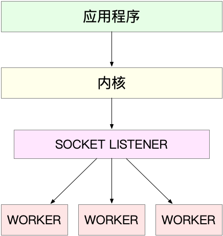

## Nginx工作模型

### 第一种，主进程+多个 worker 子进程

- 主进程执行 bind() + listen() 后，创建多个子进程；
- 然后，在每个子进程中，都通过 accept() 或 epoll_wait() ，来处理相同的套接字。

主进程主要用来初始化套接字，并管理子进程的生命周期；而 worker 进程，则负责实际的请求处理。

<div align="center">  </div><br>

这里要注意，accept() 和 epoll_wait() 调用，还存在一个惊群的问题。换句话说，当网络 I/O 事件发生时，多个进程被同时唤醒，但实际上只有一个进程来响应这个事件，其他被唤醒的进程都会重新休眠。

- 其中，accept() 的惊群问题，已经在 Linux 2.6 中解决了；

- 而 epoll 的问题，到了 Linux 4.5 ，才通过 EPOLLEXCLUSIVE 解决。

为了避免惊群问题， Nginx 在每个 worker 进程中，都增加一个了全局锁（accept_mutex）。这些 worker 进程 epoll_wait() 之前需要首先竞争到锁，只有竞争到锁的进程，才会加入到 epoll 中，这样就确保只有一个 worker 子进程被唤醒。

这些 worker 进程，实际上并不需要经常创建和销毁，而是在没任务时休眠，有任务时唤醒。只有在 worker 由于某些异常退出时，主进程才需要创建新的进程来代替它。

当然，也可以用线程代替进程：主线程负责套接字初始化和子线程状态的管理，而子线程则负责实际的请求处理。由于线程的调度和切换成本比较低，实际上你可以进一步把 epoll_wait() 都放到主线程中，保证每次事件都只唤醒主线程，而子线程只需要负责后续的请求处理。

### 第二种，监听到相同端口的多进程模型

在这种方式下，所有的进程都监听相同的接口，并且开启 `SO_REUSEPORT` 选项，由内核负责将请求负载均衡到这些监听进程中去。这一过程如下图所示。

<div align="center">  </div><br>

由于内核确保了只有一个进程被唤醒，就不会出现惊群问题了。比如，Nginx 在 1.9.1 中就已经支持了这种模式。不过要注意，想要使用`SO_REUSEPORT`选项，需要用 Linux 3.9 以上的版本才可以。


### 惊群

当 listen_fd 有新的accept()请求过来,操作系统会唤醒所有子进程,因为这些进程都 epoll_wait() 同一个 listen_fd ,操作系统又无从判断由谁来负责accept,索性干脆全部叫醒,但最终只会有一个进程成功accept,其他进程accept失败.所有子进程都是被"吓醒"的,所以称之为Thundering Herd(惊群).


## 问题

### 1. Nginx 是如何实现高并发的?

异步，非阻塞，使用epoll，和大量细节处的优化。

nginx 默认采用一个 master 进程，多个 worker 进程的模式

1. nginx 在启动后，会有一个 master 进程和多个相互独立的 worker 进程。

2. master 进程能监控 worker 进程的运行状态，当 worker 进程退出后(异常情况下)，会自动启动新的 worker 进程。

3. 网络 i/o 事件发生时，为了避免惊群现象，只有一个 worker 进程能竞争到全局锁，然后由它来处理这个新 socket。

4. worker进程里面只有一个主线程,在epoll支持下,采用异步非阻塞的方式来处理多个请求，它无须遍历整个被侦听的描述符集，只要遍历触发事件的描述符集合，大大提高了 cpu 利用率。

### 2. 为什么 Nginx 不使用多线程?

1. 如果是一个主线程和固定数目的 worker线程，理论上是可以的，不过线程出问题会影响整个进程。

2. 如果是一个主进程和固定数目的 worker进程，进程实际上并不需要经常创建和销毁，和多线程效果一样，比多线程更加稳定。

### 3. Nginx的线程池是什么？

Nginx从1.7.11加入了AIO线程池支持，能够使用AIO多线程读取和发送大文件，以免 worker 进程被阻塞(小文件用sendfile,大文件用AIO线程池)，要启用线程池支持，configure时需要显式加入--with-threads选项。


### 4. nginx是如何处理一个请求的？

首先，nginx在启动时，会解析配置文件，得到需要监听的端口与ip地址，然后在nginx的master进程里面先初始化好这个监控的socket，再进行listen,然后再fork出多个子进程出来, 子进程会竞争accept新的连接。此时，客户端就可以向nginx发起连接了。当客户端与nginx进行三次握手，与nginx建立好一个连接后,此时，某一个子进程会accept成功，然后创建nginx对连接的封装，即ngx_connection_t结构体,接着，根据事件调用相应的事件处理模块，如http模块与客户端进行数据的交换。最后，nginx或客户端来主动关掉连接，到此，一个连接就寿终正寝了


### 5. Nginx常见的优化配置有哪些?

1. 调整 worker_processes 和逻辑 cpu 个数一样
```
worker_processes 4;
```

2. 调整 worker 进程最大打开文件数
```
worker_rlimit_nofile 65535;
```

3. 使用 epoll 事件处理模型
```
events {
  use epoll;
  worker_connections 65535;
  multi_accept on;
}
```

4. 开启高效传输模式
```
http {
  include mime.types;
  default_type application/octet-stream;
  ……

  sendfile on;
  tcp_nopush on;
  ……
}
```
- sendfile on：开启高效文件传输模式，sendfile指令指定nginx是否调用sendfile函数来输出文件，避免了内核缓冲区和用户缓冲区之间的数据拷贝( DMA 把硬盘数据拷贝到 kernel buffer)，对于普通应用设为 on，如果用来进行下载等应用磁盘IO重负载应用，可设置为off，以平衡磁盘与网络I/O处理速度，降低系统的负载。


- tcp_nodelay on: 选项默认关闭。Nagle 算法规定，如果包的大小不满足MSS，并且还没收到之前发送的数据包的ack，那么这些小数据包会在发送端暂存起来，直到累积到一个MSS或者收到一个ACK为止。选项打开后则禁用 Nagle 算法。

- tcp_nopush on：在nginx中，tcp_nopush配置与tcp_nodelay不能同时打开。tcp_nopush 开启会设置TCP_CORK选项，结果就是数据包不会马上传送出去，这样有助于解决网络堵塞。发送时机：

    1. 程序取消设置TCP_CORK这个选项
    2. socket聚集的数据大于一个MSS的大小
    3. 自从堵上塞子写入第一个字节开始，已经经过200ms
    4. socket被关闭了


5. 设置合理的连接超时时间

6. gzip 压缩和调优

7. 开启缓存

8. 内核参数优化


## 参考

- [Nginx性能优化](https://www.cnblogs.com/cheyunhua/p/10670070.html)
- [Nginx面试题](https://www.jianshu.com/p/cd4fafd4477a)