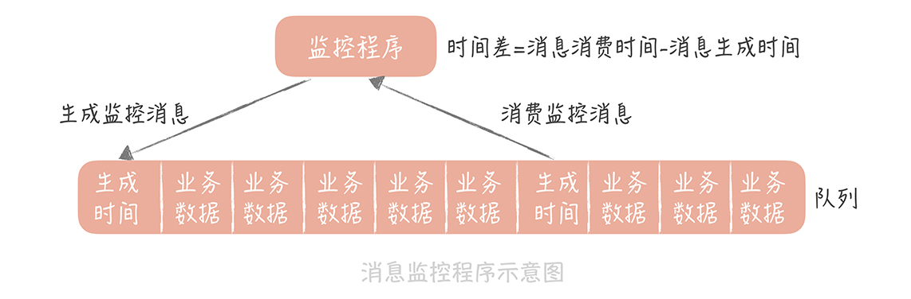

<!-- GFM-TOC -->
* [一、消息模型](#一消息模型)
    * [点对点](#点对点)
    * [发布/订阅](#发布订阅)
* [二、使用场景](#二使用场景)
    * [异步处理](#异步处理)
    * [流量削锋](#流量削锋)
    * [应用解耦](#应用解耦)
* [三、可靠性](#三可靠性)
    * [生产端的可靠性](#生产端的可靠性)
    * [存储端的可靠性](#存储端的可靠性)
    * [消费端的可靠性](#消费端的可靠性)
* [四、消息延迟](#四消息延迟)
* [参考资料](#参考资料)
<!-- GFM-TOC -->

# 一、消息模型

## 点对点

消息生产者向消息队列中发送了一个消息之后，只能被一个消费者消费一次。

  
 

## 发布/订阅

消息生产者向频道发送一个消息之后，多个消费者可以从该频道订阅到这条消息并消费。

  
 

发布与订阅模式和观察者模式有以下不同：

- 观察者模式中，观察者和主题都知道对方的存在；而在发布与订阅模式中，生产者与消费者不知道对方的存在，它们之间通过频道进行通信。
- 观察者模式是同步的，当事件触发时，主题会调用观察者的方法，然后等待方法返回；而发布与订阅模式是异步的，生产者向频道发送一个消息之后，就不需要关心消费者何时去订阅这个消息，可以立即返回。

  
 

# 二、使用场景

## 异步处理

业务流程分主要的业务逻辑和次要的业务逻辑。次要的业务逻辑不需要同步等待的话可以把消息发给消息队列，由其他程序异步处理。

例如在注册流程中通常需要发送验证邮件来确保注册用户身份的合法性，可以使用消息队列使发送验证邮件的操作异步处理，用户在填写完注册信息之后就可以完成注册，而将发送验证邮件这一消息发送到消息队列中。只有在业务流程允许异步处理的情况下才能这么做，例如上面的注册流程中，如果要求用户对验证邮件进行点击之后才能完成注册的话，就不能再使用消息队列。

例如主要的流程是生成订单、扣减库存；次要的流程是下单购买成功后给用户发放优惠券这个操作可以通过消息队列异步处理。

## 流量削锋

在高并发的场景下，如果短时间有大量的写请求到达会压垮数据库。

可以将秒杀请求暂存到消息队列中，然后业务服务器响应用户"秒杀结果计算中"，后台服务器启动若干个队列处理程序去消费消息，再执行校验库存、下单等业务逻辑。这样落到数据库上的并发请求时有限的。当库存消耗完之后，消息队列中的堆积的请求就可以被丢弃了。

## 应用解耦

如果模块之间不直接进行调用，模块之间耦合度就会很低，那么修改一个模块或者新增一个模块对其它模块的影响会很小，从而实现可扩展性。

通过使用消息队列，一个模块只需要向消息队列中发送消息，其它模块可以选择性地从消息队列中订阅消息从而完成调用。

# 三、可靠性

## 生产端的可靠性

发送端完成操作后一定能将消息成功发送到消息队列中。

两种实现方法:

- 消息重传，发送失败多试几次，不能绝对保证可靠性。
- 在本地数据库建一张消息表，将消息数据与业务数据保存在同一数据库实例里，这样就可以利用本地数据库的事务机制。事务提交成功后，将消息表中的消息转移到消息队列中，若转移消息成功则删除消息表中的数据，否则继续重传。

## 存储端的可靠性

消息存在消息队列中不能丢。

两种实现方法:

- 提高刷磁盘的频率，但是影响性能。
- 以集群的方式部署多个消息队列的副本，分布式保证安全性，确保消息尽量不丢失。

## 消费端的可靠性

接收端能够从消息队列成功消费一次消息。

两种实现方法：

- 保证接收端处理消息的业务逻辑具有幂等性：只要具有幂等性，那么消费多少次消息，最后处理的结果都是一样的。
- 保证消息具有唯一编号，并使用一张日志表来记录已经消费的消息编号。如果要求严格的话，用事务来保证写数据库和记录消息编号这两个操作的一致性，代价颇大。有的业务可以乐观锁处理，比如给一个人的账号加钱，先给每个人的账号数据中增加一个版本号的字段，在生产消息时先查询账户的版本号，把版本号连同消息一起发给消息队列。消费端拿到消息和版本号，在执行更新的SQL时带上版本号，版本号一样就可以更新成功，不一样就更新失败。

# 四、消息延迟

消费端减少消息延迟:

- 优化消费代码提升性能。
- 增加消费者的数量。
- 多线程(要注意空转问题，消费端拿不到消息可以等待一段时间)

存储端减少消息延迟:

- 选择高性能的存储方式。
- 零拷贝技术。

监控消息的延迟有两种方式:

- 使用消息队列提供的工具，通过监控消息的堆积来完成。比如Kakfa的"kafka-consumer-groups.sh"和 JMX。
- 通过生成监控消息的方式来监控消息的延迟情况。比如监控程序定时循环写入到特殊的消息到消息队列中，消息的内容可以使生成消息的时间戳。业务消费者拿到直接丢弃，监控程序拿到后比较消息的生成时间，如果时间差达到一个阈值就报警。

  
 

# 参考资料

- [Observer vs Pub-Sub](http://developers-club.com/posts/270339/)
- [消息队列中点对点与发布订阅区别](https://blog.csdn.net/lizhitao/article/details/47723105)
