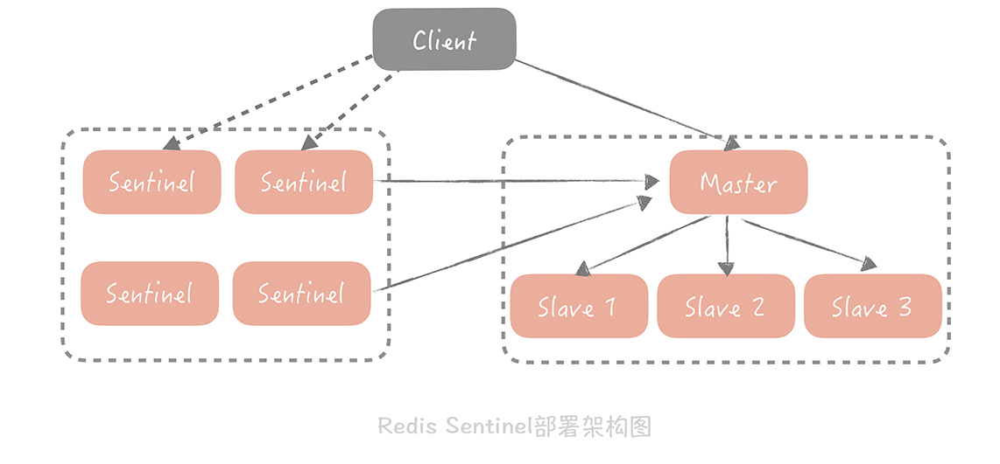
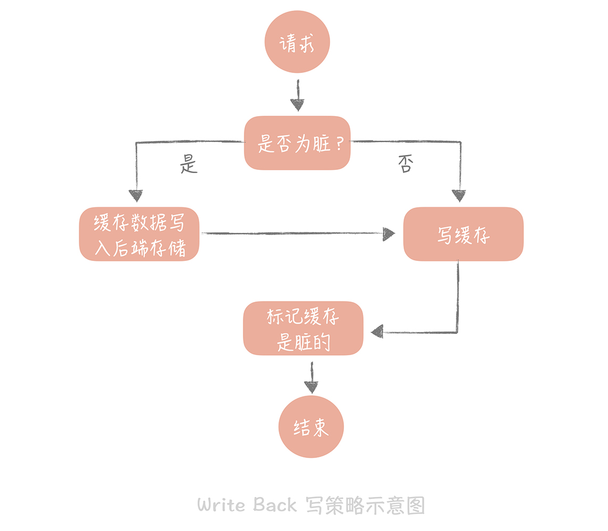

<!-- GFM-TOC -->
* [一、缓存特征](#一缓存特征)
* [二、缓存应用](#二缓存应用)
* [三、缓存分类](#二缓存分类)
* [四、缓存问题](#四缓存问题)
* [五、缓存策略](#五缓存策略)
* [六、数据分布](#六数据分布)
* [七、一致性哈希](#七一致性哈希)
* [八、LRU](#八lru)
* [参考资料](#参考资料)
<!-- GFM-TOC -->


# 一、缓存特征

## 命中率

当某个请求能够通过访问缓存而得到响应时，称为缓存命中。

缓存命中率越高，缓存的利用率也就越高。

## 最大空间

缓存通常位于内存中，内存的空间通常比磁盘空间小的多，因此缓存的最大空间不可能非常大。

当缓存存放的数据量超过最大空间时，就需要淘汰部分数据来存放新到达的数据。

## 淘汰策略

- FIFO（First In First Out）：先进先出策略，在实时性的场景下，需要经常访问最新的数据，那么就可以使用 FIFO，使得最先进入的数据（最晚的数据）被淘汰。

- LRU（Least Recently Used）：最近最久未使用策略，优先淘汰最久未使用的数据，也就是上次被访问时间距离现在最久的数据。该策略可以保证内存中的数据都是热点数据，也就是经常被访问的数据，从而保证缓存命中率。

- LFU（Least Frequently Used）：最不经常使用策略，优先淘汰一段时间内使用次数最少的数据。

# 二、缓存应用

## 浏览器

当 HTTP 响应允许进行缓存时，浏览器会将 HTML、CSS、JavaScript、图片等静态资源进行缓存。
当我们第一次请求静态的资源时，比如一张图片，服务端除了返回图片信息，在响应头里面还有一个“Etag”的字段。浏览器会缓存图片信息以及这个字段的值。当下一次再请求这个图片的时候，浏览器发起的请求头里面会有一个“If-None-Match”的字段，并且把缓存的“Etag”的值写进去发给服务端。服务端比对图片信息是否有变化，如果没有，则返回浏览器一个 304 的状态码，浏览器会继续使用缓存的图片信息。通过这种缓存协商的方式，可以减少网络传输的数据大小，从而提升页面展示的性能。

## APP

短视频 APP 的播放器中通常会设计一些缓存的组件，在未打开视频时缓存一部分视频数据，比如我们打开抖音，服务端可能一次会返回三个视频信息，我们在播放第一个视频的时候，播放器已经帮我们缓存了第二、三个视频的部分数据，这样在看第二个视频的时候就可以给用户“秒开”的感觉。

## ISP

网络服务提供商（ISP）是网络访问的第一跳，通过将数据缓存在 ISP 中能够大大提高用户的访问速度。

## Linux

Linux 内存管理是通过一个叫做 MMU（Memory Management Unit）的硬件，来实现从虚拟地址到物理地址的转换的，但是如果每次转换都要做这么复杂计算的话，无疑会造成性能的损耗，所以我们会借助一个叫做 TLB（Translation Lookaside Buffer）的组件来缓存最近转换过的虚拟地址和物理地址的映射。

## 反向代理

反向代理位于服务器之前，请求与响应都需要经过反向代理。通过将数据缓存在反向代理，在用户请求反向代理时就可以直接使用缓存进行响应。

## 数据库缓存

MySQL 等数据库管理系统具有自己的查询缓存机制来提高查询效率。

## Java 内部的缓存

Java 为了优化空间，提高字符串、基本数据类型包装类的创建效率，设计了字符串常量池及 Byte、Short、Character、Integer、Long、Boolean 这六种包装类缓冲池。

## CPU 多级缓存

CPU 为了解决运算速度与主存 IO 速度不匹配的问题，引入了多级缓存结构，同时使用 MESI 等缓存一致性协议来解决多核 CPU 缓存数据一致性的问题。

## CDN

内容分发网络（Content distribution network，CDN）是一种互连的网络系统，它利用更靠近用户的服务器从而更快更可靠地将 HTML、CSS、JavaScript、音乐、图片、视频等静态资源分发给用户。

CDN 主要有以下优点：

- 更快地将数据分发给用户；
- 通过部署多台服务器，从而提高系统整体的带宽性能；
- 多台服务器可以看成是一种冗余机制，从而具有高可用性。

重点:

- 通过 DNS 把公司的静态资源的域名映射到 CDN 节点上；
- DNS 解析结果要做本地缓存，降低 DNS 解析过程的响应时间；
- GSLG 可以给用户返回一个离他更近的节点，加快静态资源的访问速度。

<div align="center">  </div><br>


# 三、缓存分类

- 静态缓冲
- 分布式缓存
- 热点本地缓存


# 四、缓存问题

## 缓存穿透

缓存穿透其实是指从缓存中没有查到数据，而不得不从后端系统（比如数据库）中查询的情况。

最大的问题在于数据库中并不存在用户的数据，这就造成无论查询多少次，数据库中永远都不会存在这个用户的数据，穿透永远都会发生。

解决方案：

### 1. 回种空值

从数据库中查询到空值或者发生异常时向缓存中回种一个空值，并加上过期时间。大量的空值缓存，也就会浪费缓存的存储空间，如果缓存空间被占满了，还会剔除掉一些已经被缓存的用户信息反而会造成缓存命中率的下降。

### 2. 布隆过滤器

以存储用户信息的表为例进行讲解。首先，初始化一个很大的数组，比方说长度为 20 亿的数组，接下来我们选择一个 Hash 算法，然后我们将目前现有的所有用户的 ID 计算出 Hash 值并且映射到这个大数组中，映射位置的值设置为 1，其它值设置为 0。

新注册的用户除了需要写入到数据库中之外，它也需要依照同样的算法更新布隆过滤器的数组中，相应位置的值。那么当我们需要查询某一个用户的信息时，我们首先查询这个 ID 在布隆过滤器中是否存在，如果不存在就直接返回空值，而不需要继续查询数据库和缓存，这样就可以极大地减少异常查询带来的缓存穿透。

### 其他

 对于极热点缓存数据穿透造成的“狗桩效应”，可以通过设置分布式锁或者后台线程定时加载的方式来解决。

 比方说当有一个极热点的缓存项，它一旦失效会有大量请求穿透到数据库，这会对数据库造成瞬时极大的压力，我们把这个场景叫做“dog-pile effect”（狗桩效应）。

 解决狗桩效应的思路是尽量地减少缓存穿透后的并发，方案也比较简单：

 1. 在代码中，控制在某一个热点缓存项失效之后启动一个后台线程，穿透到数据库，将数据加载到缓存中，在缓存未加载之前，所有访问这个缓存的请求都不再穿透而直接返回。

2. 通过在 Memcached 或者 Redis 中设置分布式锁，只有获取到锁的请求才能够穿透到数据库。

## 缓存雪崩

指的是由于数据没有被加载到缓存中，或者缓存数据在同一时间大面积失效（过期），又或者缓存服务器宕机，导致大量的请求都到达数据库。

在有缓存的系统中，系统非常依赖于缓存，缓存分担了很大一部分的数据请求。当发生缓存雪崩时，数据库无法处理这么大的请求，导致数据库崩溃。

解决方案：

- 为了防止缓存在同一时间大面积过期导致的缓存雪崩，可以通过观察用户行为，合理设置缓存过期时间来实现；
- 为了防止缓存服务器宕机出现的缓存雪崩，可以使用分布式缓存，分布式缓存中每一个节点只缓存部分的数据，当某个节点宕机时可以保证其它节点的缓存仍然可用。
- 也可以进行缓存预热，避免在系统刚启动不久由于还未将大量数据进行缓存而导致缓存雪崩。


## 缓存一致性

缓存一致性要求数据更新的同时缓存数据也能够实时更新。

解决方案：

- 在数据更新的同时立即去更新缓存；
- 在读缓存之前先判断缓存是否是最新的，如果不是最新的先进行更新。

要保证缓存一致性需要付出很大的代价，缓存数据最好是那些对一致性要求不高的数据，允许缓存数据存在一些脏数据。

## 缓存 “无底洞” 现象

指的是为了满足业务要求添加了大量缓存节点，但是性能不但没有好转反而下降了的现象。

产生原因：缓存系统通常采用 hash 函数将 key 映射到对应的缓存节点，随着缓存节点数目的增加，键值分布到更多的节点上，导致客户端一次批量操作会涉及多次网络操作，这意味着批量操作的耗时会随着节点数目的增加而不断增大。此外，网络连接数变多，对节点的性能也有一定影响。

解决方案：

- 优化批量数据操作命令；
- 减少网络通信次数；
- 降低接入成本，使用长连接 / 连接池，NIO 等。

## 缓存高可用

- **客户端方案** 就是在客户端配置多个缓存的节点，通过缓存写入和读取算法策略来实现分布式，从而提高缓存的可用性。这种方案的好处是性能没有损耗，缺点是客户端逻辑复杂且在多语言环境下不能复用。

- **中间代理层方案** 是在应用代码和缓存节点之间增加代理层，客户端所有的写入和读取的请求都通过代理层，而代理层中会内置高可用策略，帮助提升缓存系统的高可用。比如Twitter 的[Twemproxy](https://github.com/twitter/twemproxy)，豌豆荚的[Codis](https://github.com/CodisLabs/codis)。方案的缺点是在性能上会有一些损耗。

- **服务端方案** Redis 在 2.4 版本中提出了 Redis Sentinel 模式来解决主从 Redis 部署时的高可用问题，它可以在主节点挂了以后自动将从节点提升为主节点，保证整体集群的可用性。服务端方案会在运维上增加一些复杂度。

<div align="center">  </div><br>


# 五、缓存策略

## Cache Aside（旁路缓存）

更新数据记录再更新缓存，当并发更新它们的时候，就会因为写入顺序的不同造成数据的不一致。

读策略的步骤:

- 从缓存中读取数据；
- 如果缓存命中，则直接返回数据；
- 如果缓存不命中，则从数据库中查询数据；
- 查询到数据后，将数据写入到缓存中，并且返回给用户。

写策略的步骤:

- 更新数据库中的记录；
- 删除缓存记录

Cache Aside 策略是我们日常开发中最经常使用的缓存策略，不过我们在使用时也要学会依情况而变。

比如说当新注册一个用户，按照这个更新策略，你要写数据库，然后清理缓存（当然缓存中没有数据给你清理）。可当我注册用户后立即读取用户信息，并且数据库主从分离时，会出现因为主从延迟所以读不到用户信息的情况。

而解决这个问题的办法恰恰是在插入新数据到数据库之后写入缓存，这样后续的读请求就会从缓存中读到数据了。并且因为是新注册的用户，所以不会出现并发更新用户信息的情况。

Cache Aside 存在的最大的问题是当写入比较频繁时，缓存中的数据会被频繁地清理，这样会对缓存的命中率有一些影响。如果你的业务对缓存命中率有严格的要求，那么可以考虑两种解决方案:

- 一种做法是在更新数据时也更新缓存，只是在更新缓存前先加一个分布式锁，因为这样在同一时间只允许一个线程更新缓存，就不会产生并发问题了。当然这么做对于写入的性能会有一些影响；

- 另一种做法同样也是在更新数据时更新缓存，只是给缓存加一个较短的过期时间，这样即使出现缓存不一致的情况，缓存的数据也会很快地过期，对业务的影响也是可以接受。

## Read/Write Through（读穿 / 写穿）

这个策略的核心原则是用户只与缓存打交道，由缓存和数据库通信，写入或者读取数据

<div align="center">  </div><br>


## Write Back（写回）策略

这个策略的核心思想是在写入数据时只写入缓存，并且把缓存块儿标记为“脏”的。而脏块儿只有被再次使用时才会将其中的数据写入到后端存储中。

<div align="center">  </div><br>

<div align="center">  </div><br>


应用:  
你在向低速设备写入数据的时候，可以在内存里先暂存一段时间的数据，甚至做一些统计汇总，然后定时地刷新到低速设备上。比如说，你在统计你的接口响应时间的时候，需要将每次请求的响应时间打印到日志中，然后监控系统收集日志后再做统计。但是如果每次请求都打印日志无疑会增加磁盘 I/O，那么不如把一段时间的响应时间暂存起来，经过简单的统计平均耗时，每个耗时区间的请求数量等等，然后定时地，批量地打印到日志中。


# 六、数据分布

## 哈希分布

哈希分布就是将数据计算哈希值之后，按照哈希值分配到不同的节点上。例如有 N 个节点，数据的主键为 key，则将该数据分配的节点序号为：hash(key)%N。

传统的哈希分布算法存在一个问题：当节点数量变化时，也就是 N 值变化，那么几乎所有的数据都需要重新分布，将导致大量的数据迁移。

## 顺序分布

将数据划分为多个连续的部分，按数据的 ID 或者时间分布到不同节点上。例如 User 表的 ID 范围为 1 \~ 7000，使用顺序分布可以将其划分成多个子表，对应的主键范围为 1 \~ 1000，1001 \~ 2000，...，6001 \~ 7000。

顺序分布相比于哈希分布的主要优点如下：

- 能保持数据原有的顺序；
- 并且能够准确控制每台服务器存储的数据量，从而使得存储空间的利用率最大。

# 七、一致性哈希

Distributed Hash Table（DHT） 是一种哈希分布方式，其目的是为了克服传统哈希分布在服务器节点数量变化时大量数据迁移的问题。

## 基本原理

将哈希空间 [0, 2<sup>n</sup>-1] 看成一个哈希环，每个服务器节点根据服务器的IP或主机名作为关键字进行哈希，确定它在哈希环上的位置。每个数据对象key通过哈希取模得到哈希值之后，存放到哈希环中顺时针方向第一个大于等于该哈希值的节点上。

<div align="center">  </div><br>

一致性哈希在增加或者删除节点时只会影响到哈希环中相邻的节点，例如下图中新增节点 X，只需要将它前一个节点 C 上的数据重新进行分布即可，对于节点 A、B、D 都没有影响。

<div align="center">  </div><br>

## 虚拟节点

上面描述的一致性哈希存在数据分布不均匀的问题，节点存储的数据量有可能会存在很大的不同。

数据不均匀主要是因为节点在哈希环上分布的不均匀，这种情况在节点数量很少的情况下尤其明显。

解决方式是通过增加虚拟节点，然后将虚拟节点映射到真实节点上。虚拟节点的数量比真实节点来得多，那么虚拟节点在哈希环上分布的均匀性就会比原来的真实节点好，从而使得数据分布也更加均匀。

## 脏数据问题

在集群中有两个节点 A 和 B，客户端初始写入一个 Key 为 k，值为 3 的缓存数据到 Cache A 中。这时如果要更新 k 的值为 4，但是缓存 A 恰好和客户端连接出现了问题，那这次写入请求会写入到 Cache B 中。接下来缓存 A 和客户端的连接恢复，当客户端要获取 k 的值时，就会获取到存在 Cache A 中的脏数据 3，而不是 Cache B 中的 4。

所以，在使用一致性 Hash 算法时一定要设置缓存的过期时间，这样当发生漂移时，之前存储的脏数据可能已经过期，就可以减少存在脏数据的几率。

## 代码实现
```go
// https://github.com/golang/groupcache/blob/master/consistenthash/consistenthash.go

package consistenthash

import (
	"hash/crc32"
	"sort"
	"strconv"
)

type Hash func(data []byte) uint32

type Map struct {
	hash     Hash
	replicas int
	keys     []int // Sorted
	hashMap  map[int]string
}

func New(replicas int, fn Hash) *Map {
	m := &Map{
		replicas: replicas,
		hash:     fn,
		hashMap:  make(map[int]string),
	}
	if m.hash == nil {
		m.hash = crc32.ChecksumIEEE
	}
	return m
}

// IsEmpty returns true if there are no items available.
func (m *Map) IsEmpty() bool {
	return len(m.keys) == 0
}

// Add adds some keys to the hash.
// 添加真实节点的key，比如ip,主机名
// replicas 个虚拟节点对应一个真实节点
func (m *Map) Add(keys ...string) {
	for _, key := range keys {
		for i := 0; i < m.replicas; i++ {
			hash := int(m.hash([]byte(strconv.Itoa(i) + key)))
			m.keys = append(m.keys, hash)
			m.hashMap[hash] = key
		}
	}
	sort.Ints(m.keys)
}

// Get gets the closest item in the hash to the provided key.
// 根据数据的key找到顺时针方向第一个大于它hash值的存储节点
func (m *Map) Get(key string) string {
	if m.IsEmpty() {
		return ""
	}

	hash := int(m.hash([]byte(key)))

	// Binary search for appropriate replica.
	idx := sort.Search(len(m.keys), func(i int) bool { return m.keys[i] >= hash })

	// Means we have cycled back to the first replica.
	if idx == len(m.keys) {
		idx = 0
	}

	return m.hashMap[m.keys[idx]]
}
```

# 八、LRU

以下是基于 双向链表 + HashMap 的 LRU 算法实现，对算法的解释如下：

- 访问某个节点时，先判断Key 在 HashMap 是否存在，存在将节点移动到链表头部，这样就能保证链表尾部存储的就是最近最久未使用的节点。
- 插入某个节点时，如果已经存在就把它移动到链表头部并更新节点的值，不存在就插入到链表头部和 HashMap。检查节点数量大于缓存最大空间时就淘汰链表尾部的节点。
- 删除节点的时候，由于 HashMap 存储着 Key 到节点的映射，通过 Key 就能以 O(1) 的时间得到节点，然后再以 O(1) 的时间将其从双向链表和 HashMap 删除。

```go
// https://github.com/golang/groupcache/blob/master/lru/lru.go

package lru

import "container/list"

// Cache is an LRU cache. It is not safe for concurrent access.
type Cache struct {
	// MaxEntries is the maximum number of cache entries before
	// an item is evicted. Zero means no limit.
	MaxEntries int

	// OnEvicted optionally specifies a callback function to be
	// executed when an entry is purged from the cache.
	OnEvicted func(key Key, value interface{})

	ll    *list.List
	cache map[interface{}]*list.Element
}

// A Key may be any value that is comparable. See http://golang.org/ref/spec#Comparison_operators
type Key interface{}

type entry struct {
	key   Key
	value interface{}
}

// New creates a new Cache.
// If maxEntries is zero, the cache has no limit and it's assumed
// that eviction is done by the caller.
func New(maxEntries int) *Cache {
	return &Cache{
		MaxEntries: maxEntries,
		ll:         list.New(),
		cache:      make(map[interface{}]*list.Element),
	}
}

// Add adds a value to the cache.
func (c *Cache) Add(key Key, value interface{}) {
	if c.cache == nil {
		c.cache = make(map[interface{}]*list.Element)
		c.ll = list.New()
	}
	if ee, ok := c.cache[key]; ok {
		c.ll.MoveToFront(ee)
		ee.Value.(*entry).value = value
		return
	}
	ele := c.ll.PushFront(&entry{key, value})
	c.cache[key] = ele
	if c.MaxEntries != 0 && c.ll.Len() > c.MaxEntries {
		c.RemoveOldest()
	}
}

// Get looks up a key's value from the cache.
func (c *Cache) Get(key Key) (value interface{}, ok bool) {
	if c.cache == nil {
		return
	}
	if ele, hit := c.cache[key]; hit {
		c.ll.MoveToFront(ele)
		return ele.Value.(*entry).value, true
	}
	return
}

// Remove removes the provided key from the cache.
func (c *Cache) Remove(key Key) {
	if c.cache == nil {
		return
	}
	if ele, hit := c.cache[key]; hit {
		c.removeElement(ele)
	}
}

// RemoveOldest removes the oldest item from the cache.
func (c *Cache) RemoveOldest() {
	if c.cache == nil {
		return
	}
	ele := c.ll.Back()
	if ele != nil {
		c.removeElement(ele)
	}
}

func (c *Cache) removeElement(e *list.Element) {
	c.ll.Remove(e)
	kv := e.Value.(*entry)
	delete(c.cache, kv.key)
	if c.OnEvicted != nil {
		c.OnEvicted(kv.key, kv.value)
	}
}

// Len returns the number of items in the cache.
func (c *Cache) Len() int {
	if c.cache == nil {
		return 0
	}
	return c.ll.Len()
}

// Clear purges all stored items from the cache.
func (c *Cache) Clear() {
	if c.OnEvicted != nil {
		for _, e := range c.cache {
			kv := e.Value.(*entry)
			c.OnEvicted(kv.key, kv.value)
		}
	}
	c.ll = nil
	c.cache = nil
}
```

# 参考资料

- 大规模分布式存储系统
- [缓存那些事](https://tech.meituan.com/cache_about.html)
- [一致性哈希算法](https://my.oschina.net/jayhu/blog/732849)
- [内容分发网络](https://zh.wikipedia.org/wiki/%E5%85%A7%E5%AE%B9%E5%82%B3%E9%81%9E%E7%B6%B2%E8%B7%AF)
- [一篇文章让你明白CPU缓存一致性协议MESI](https://juejin.im/post/5de795296fb9a016323d6466)
- [深入剖析Redis系列(二) - Redis哨兵模式与高可用集群](https://juejin.im/post/5b7d226a6fb9a01a1e01ff64)
- [How Aspiration CDN helps to improve your website loading speed?](https://www.aspirationhosting.com/aspiration-cdn/)
